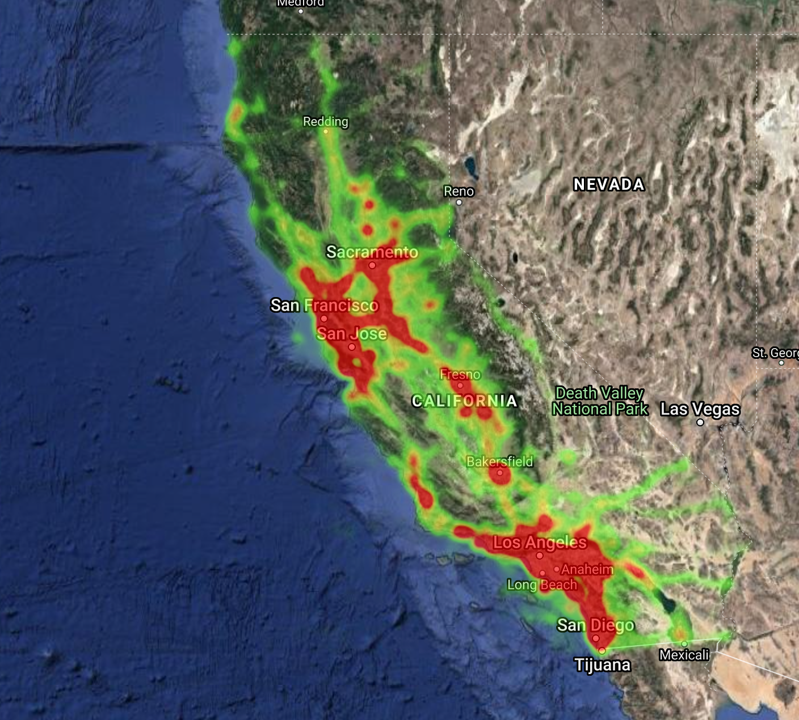
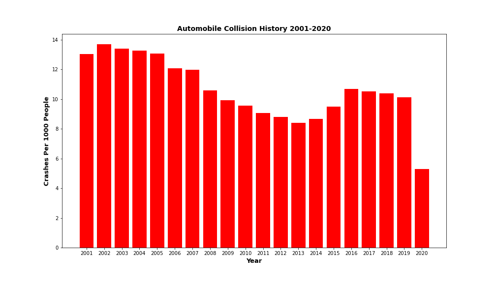
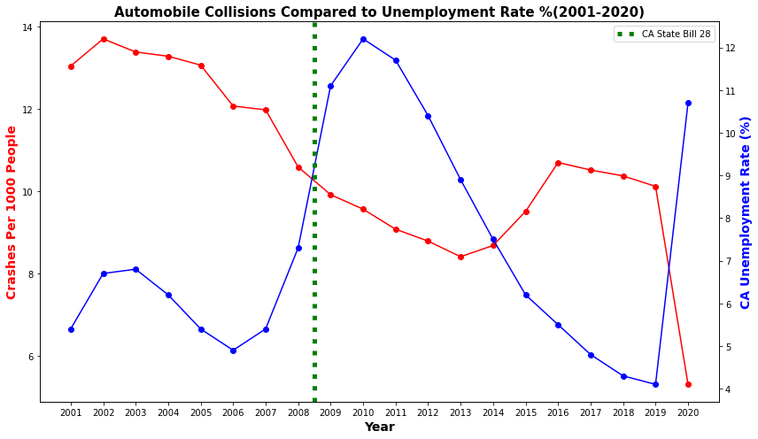
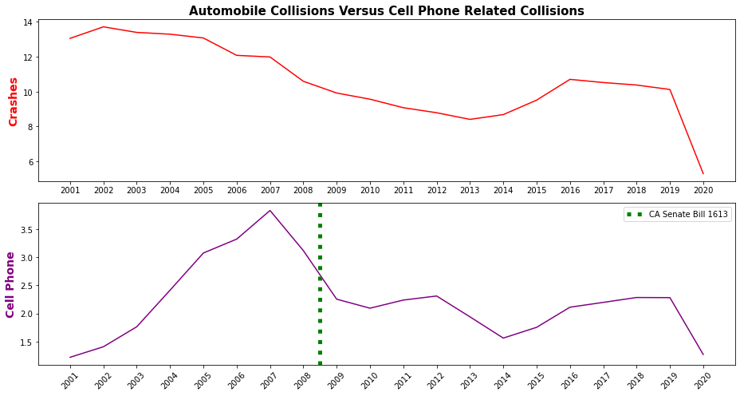

# Data Analysis - California Collision History 2001-2020

## Motivation 
According to the [CDC](https://www.cdc.gov/transportationsafety/pdf/statecosts/2020/CDC-Cost-of-Crash-Deaths-Fact-Sheets_California.pdf), in 2018 traffic collision deaths cost the state of California $5.83 billion. Furthermore, since 2001, 35,385 people have died in CA due to automobile collisions. I felt that by analyzing the historical automobile collision trends and correlating them to outside factors can provide useful data to state and local governments. This data can be used to plan trafffic policy, create local or state traffic laws, and rightsize CHP staffing. My objective is to examine this dataset and give an insight into what factors might influence collisions.

## Data

* This data comes from the [California Highway Patrol Data Set](https://www.kaggle.com/alexgude/california-traffic-collision-data-from-switrs). It covers collisions from Jan 1,2001 to October 2020.  

* There are 3 main tables. The collisions table has 74 columns, parties table has 31 columns and victims table has 11 columns.

    1. **collisions**: Contains ~9.17 Million rows, data about the collision, location, what vehicles were involved, officer data
    2. **parties**: Contains ~18Million rows, columns include age, sex, and sobriety
    3. **victims**: Contains ~9.17 Million rows, contains information about the injuries of specific people involved in the collision.

* My analysis led me to use a few columns heavily: killed_victims, cellphone_use, latitude, longitude, male/female, alcohol_involved

## Exploratory Data Analysis

* Using the latitude and longitude columns, I produced a heatmap to visually look at where the majority of the collisions occurred in the last 20 years. Out of 9.17 million rows, only 2.52 million had data. 

    

    * San Francisco county is the highest in density in the state of California. Orange and Los Angeles follow as second and third. It makes sense that the highest density locations is where the heat map is most red, representing higher number of collisions. Local governments should consider adjusting traffic policy and implementation based on the occurrence of the areas of high collisions.

* **86%** of the total collisions in the dataset are automobile accidents. The rest of the collisions are bicycle, motorcycle, pedestrian, and truck collisions.

* Here is a closer look at the automobile collision history. Having normalized for population, the below graph shows the crashes per 1000 people over the course of 20 years.

    

    * Crashes were in the 12-14 crashes per 1000 people range from 2001 to 2007. In 2008, the crashes steadily dropped for several years until 2013 when they started going back up, but never as high as the initial trend. In 2020, the crashes dropped by almost 50% due to COVID 19.

## Statistical Test

* I was curious to map the unemployment rate % to see how well it correlated with crashes. This graph is exaggerated due to the different y axes. We can see from 2001-2006 there was a slight positive correlation between crash rates and unemployment rate. From 2008 to 2020, there seems to be an inverse correlation.

    
    
* The Pearson R correlation is  **-0.57**. There is a moderately inverse correlation between unemployment rate % and crashes per 1000 people. This makes sense because crashes will drop when less people are driving to work.

* The unemployment rate went up from 2007 to 2010 due to the **Great Recession.** It was the worst and longest standing financial crisis in the United States since the 1929 Depression. Subprime mortgage was the trigger. 

* In July 2008, [CA Senate Bill 1613](https://www.ncbi.nlm.nih.gov/pmc/articles/PMC4001674/ ) went into effect. It banned the use of cell phones for hand held conversations while driving. In Jan 2009 texting ban was added.

    

       
## Hypothesis

* I used the **Fisher exact test** in my hypothesis testing because it is used for binary testing, it is applicable in two situations. I wanted to test whether there is an association between automobile collisions and cell phone involved collisions within my dataset or whether these are independent.

1. **Does the CA bill reduce cell phone related collisions?**
    *   **Null**: Rate of crashes involving cell phone use is not lower after the CA bill is passed
    *   **Alternate**: rate of automobile crashes involving cell phone use is lower after the CA   bill is passed
    *   Performing the Fisher Exact test gives a p value of 2.89e-243. With a .05 alpha, I can confidently say that there is enough evidence to state that the rate of automobile crashes involving cell phone use is lower after the CA bill is passed.
    
    **Government policies can make a difference.** 

## Future Directions

* In future research, I would explore other parts of this data set and look at the victims column.
* In addition, there are other factors that would be interesting to look at and do statistical testing on:
    1. Improved vehicle stafety standards
    2. Smarter cars - sensors, AEB(automatic emergency braking)
    3. Driver distraction related accidents
    4. Increase in carpooling 

## Resources

[CA 2001-2020 Traffic Collisions Database](https://www.kaggle.com/alexgude/california-traffic-collision-data-from-switrs)

[CDC California 2018 Collision Death Costs](https://www.cdc.gov/transportationsafety/pdf/statecosts/2020/CDC-Cost-of-Crash-Deaths-Fact-Sheets_California.pdf)

[CA Senate Bill 1613](https://www.ncbi.nlm.nih.gov/pmc/articles/PMC4001674/ )

[CA Population Statistics](https://www.statista.com/statistics/206097/resident-population-in-california/)

[CA Unemployment Rate History](https://fred.stlouisfed.org/series/CAUR)

            
            

        